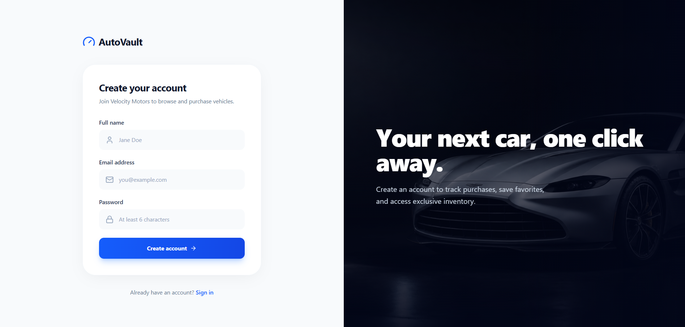
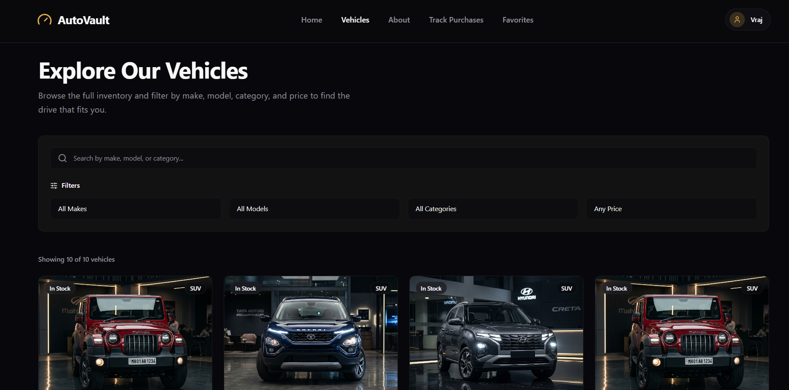
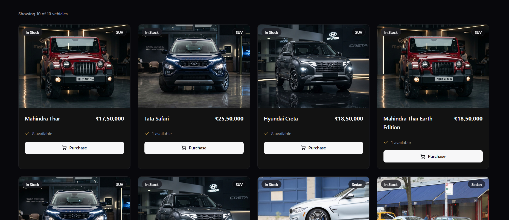
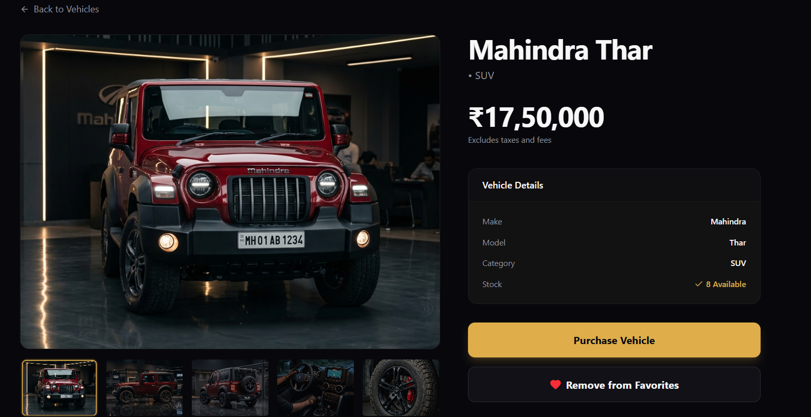
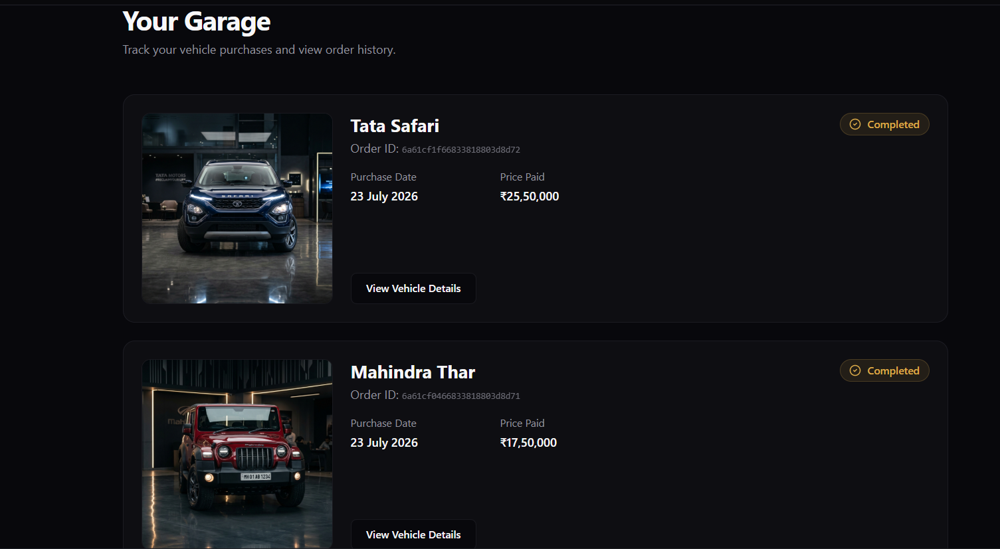
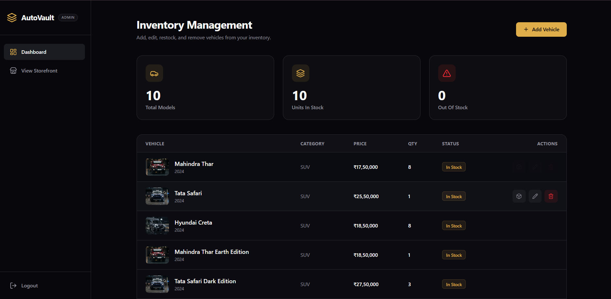

# AutoVault - Car Dealership Inventory System

## Project Overview
AutoVault is a comprehensive and dynamic web-based Car Dealership Inventory System designed to streamline the management and purchasing of vehicles. The system allows end-users to browse an exclusive catalog of premium vehicles, filter by various attributes, track their purchases in real-time, and favorite cars they love. For administrators, it provides a powerful dashboard to seamlessly add, update, delete, and restock inventory, ensuring the dealership always operates smoothly and efficiently.

## Features
- User registration and login
- JWT authentication
- Browse vehicles
- Search and filter vehicles
- Purchase vehicles
- Admin add/update/delete vehicles
- Admin restock vehicles
- Role-based authorization

## Tech Stack

### Frontend
- React
- Tailwind CSS
- React Router
- Lucide React (Icons)
- Axios

### Backend
- Node.js
- Express.js
- MongoDB
- Mongoose
- JWT (JSON Web Tokens)
- Multer & Cloudinary (for Image Uploads)
- Jest & Supertest (for Testing)

## Project Structure
```text
AutoVault/
├── backend/                  # Node.js + Express API
│   ├── src/                  # Source code for API
│   │   ├── config/           # Configuration files (DB, Cloudinary)
│   │   ├── controller/       # Request handlers (auth, vehicle, user)
│   │   ├── middleware/       # JWT auth and file upload middlewares
│   │   ├── models/           # Mongoose schemas (User, Vehicle, Purchase)
│   │   ├── routes/           # Express API routes
│   │   ├── app.js            # Express app configuration
│   │   └── server.js         # Entry point for backend server
│   └── tests/                # Jest integration tests
│
└── frontend/                 # React frontend application
    ├── src/
    │   ├── components/       # Reusable UI components (Modals, CTA, Navbar)
    │   ├── context/          # React Context (AuthContext)
    │   ├── hooks/            # Custom React hooks (useFavorites)
    │   ├── lib/              # API utilities and configuration
    │   └── pages/            # Application views (Home, Vehicles, AdminDashboard, etc.)
    └── package.json          # Frontend dependencies
```

## Local Setup

### Backend Setup
1. Open a terminal and navigate to the backend directory:
   ```bash
   cd backend
   ```
2. Install the necessary dependencies:
   ```bash
   npm install
   ```
3. Create a `.env` file in the `backend/` directory using the environment variables listed below.
4. Start the development server:
   ```bash
   npm run dev
   ```

### Frontend Setup
1. Open a new terminal and navigate to the frontend directory:
   ```bash
   cd frontend
   ```
2. Install the necessary dependencies:
   ```bash
   npm install
   ```
3. Start the development server:
   ```bash
   npm run dev
   ```

## Environment Variables
Create a `.env` file in the `backend/` directory with the following variables. Do not share your actual secret values!
- `PORT`
- `MONGODB_URI`
- `JWT_SECRET`
- `CLOUDINARY_CLOUD_NAME`
- `CLOUDINARY_API_KEY`
- `CLOUDINARY_API_SECRET`


## Running Tests
To run the automated integration tests for the backend (which utilize Jest and Supertest), navigate to the backend directory and run:

```bash
cd backend
npm test
```

## Screenshots
- **Landing Page:** 
- **Login:** [loginpage](screenshots/image-1.png) 
- **User Dashboard / Garage:**  
- **Vehicle Details:**  
- **Admin Dashboard:** 

## My AI Usage

AI tools were used during the development of AutoVault as development assistants. I reviewed, tested, debugged, and adapted AI-assisted code according to the project requirements rather than relying on generated output without verification.

### AI Tools Used

#### 1. ChatGPT

ChatGPT was primarily used for:

- Understanding project requirements and planning the development workflow.
- Understanding and applying the Red-Green-Refactor TDD approach.
- Identifying and generating test scenarios for backend features.
- Debugging failed Jest and Supertest integration tests.
- Understanding authentication and role-based authorization using JWT.
- Planning REST API structure for vehicles, inventory, and purchases.
- Discussing frontend architecture for public, user, and admin interfaces.
- Debugging React and React Router issues.
- Reviewing implementation approaches and suggesting improvements.

#### 2. Gemini / Antigravity

Gemini through Antigravity was primarily used as an AI coding assistant for:

- Generating and modifying frontend components.
- Creating the AutoVault landing page and responsive UI.
- Assisting with Login and Registration interfaces.
- Creating User and Admin dashboard interfaces.
- Building vehicle listing and vehicle details UI.
- Assisting with implementation based on provided requirements and prompts.
- Generating boilerplate and repetitive code where appropriate.
- Helping modify existing project files while maintaining the established project structure.

### How AI-Generated Code Was Used

AI-generated suggestions and code were not accepted blindly. Generated code was reviewed and modified to fit the existing architecture and project requirements.

The development process included:

- Reviewing generated code before integration.
- Running automated tests to validate backend functionality.
- Debugging and correcting failed implementations.
- Manually integrating generated code with existing components and APIs.
- Verifying authentication and authorization behavior.
- Testing frontend functionality and responsiveness.
- Using Git commits to track development progress and the Red-Green-Refactor workflow.

### Test-Driven Development and AI

The project follows a Red-Green-Refactor workflow where applicable:

1. **Red** - Tests were written for expected behavior and executed to confirm failure before implementation.
2. **Green** - The required functionality was implemented until the tests passed.
3. **Refactor** - Code was cleaned up or improved while ensuring that existing tests continued to pass.

AI tools assisted with identifying test cases, debugging failures, and suggesting implementations, while test execution and verification were used to validate the final behavior.

### AI Transparency

The prompts and AI-assisted development interactions used during the project are documented in `PROMPTS.md`.

Commits involving significant AI assistance include appropriate AI attribution/co-authorship information where required.

## Test Report
Please view the [TEST_REPORT.md](./TEST_REPORT.md) for detailed information on test coverage and execution.

## AI Prompt History
Please view the [PROMPTS.md](./PROMPTS.md) for a record of the AI prompts used during development.
